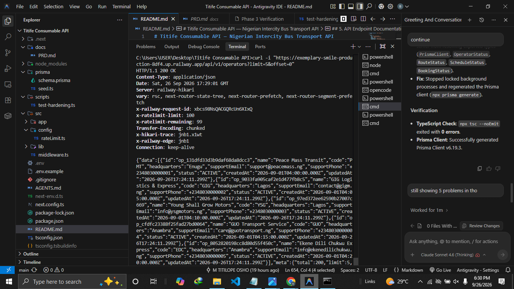
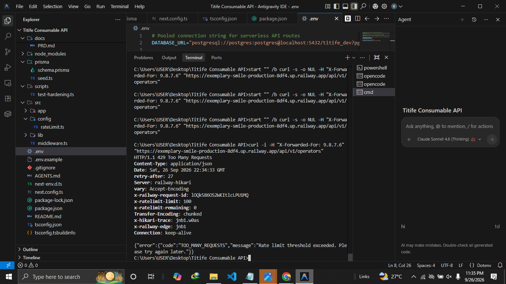
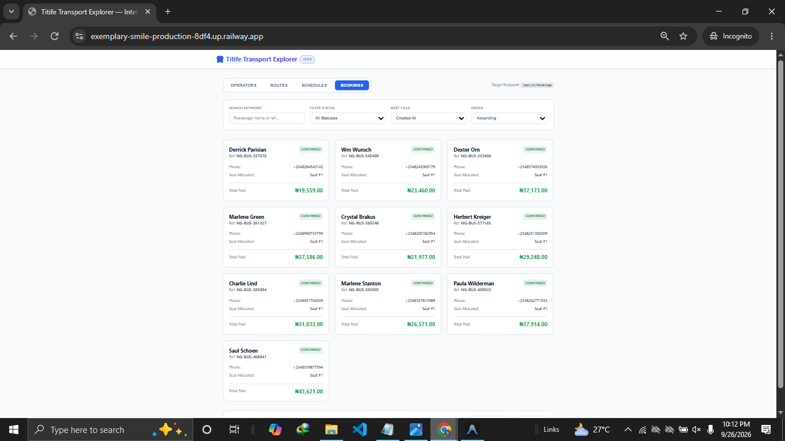

# Titife Consumable API — Assessment Write-Up

What was built, the decisions behind it, and how it was verified. The API reference is **not**
repeated here: every route, parameter, body, response shape, and `curl` example is in
[`README.md`](README.md) §5. Requirements are in [`docs/PRD.md`](docs/PRD.md); operating rules in
[`AGENTS.md`](AGENTS.md).

## 1. Scope

**Built** — a public read/write REST API for Nigerian intercity bus transport, plus one web
consumer that exercises it. All 18 endpoint/method combinations sit under `/api/v1/`: `GET`/`POST`
on the 4 collections (8), `GET`/`PATCH` on the 4 `:id` routes (8), and 2 read-only sub-resource
lists (`/operators/:id/routes`, `/routes/:id/schedules`). The consumer (`src/app/page.tsx`) is a
single client component with resource tabs, a search/filter bar, and next/previous paging driven
entirely by the API's `meta` block.

| Resource | Purpose | Seeded |
| :--- | :--- | :--- |
| Operators (`op_`) | Transport companies | 200 |
| Routes (`rot_`) | Intercity corridors between states/cities | 300 |
| Schedules (`sch_`) | A specific departure on a route | 300 |
| Bookings (`bkg_`) | A passenger ticket against a schedule | 500 |

### Intentionally excluded

Named non-goals in the PRD, deliberately not built — scope decisions, not omissions:
- **No auth, login, JWT, or RBAC** — all 18 endpoints are public; auth would change the security
  model of all of them and require credential storage.
- **No admin panel or marketing pages** — the only page is the consumer at `/`.
- **No payment gateway** — bookings are recorded `CONFIRMED` with a `totalAmount`; no money
  moves. A provider webhook would add a secret, a reconciliation model, and idempotency.
- **No real-time GPS or WebSockets** — schedules are polled; vehicle positions aren't modelled.
- **No multi-currency** — `currency` is fixed to `NGN` and every amount is an integer in kobo; a
  second currency would need FX rates and rounding rules, and float money is what this avoids.

## 2. Architecture and Key Decisions

```
src/
  middleware.ts  rate limit gate (/api/:path*)   config/rateLimit.ts  RATE_LIMIT_CONFIG + checkRateLimit(ip)
  lib/           prisma singleton, cuid2 ids, envelope helpers, Zod + pagination/sort validation
  app/           page.tsx consumer UI · api/[...path]/ JSON 404 catch-all · api/v1/<res>/ collections, [id]/, 2 sub-resources
prisma/         schema.prisma (4 models, 4 enums, filter/sort indexes) · seed.ts (deterministic Faker)
```

**One envelope, one error shape.** `successResponse` emits `{ data }`, adding `meta` only when
pagination applies; `errorResponse` always emits `{ error: { code, message } }`. No handler builds
a response by hand, so a client parses any response without branching on the endpoint.

**Framework errors are intercepted, not leaked.** `app/api/[...path]/route.ts` returns a JSON
`404` for all seven standard methods, so no unmatched path **under `/api/`** yields Next's HTML
error page. Every `v1` route file likewise exports `PUT`/`DELETE`/`PATCH` handlers returning `405`
with an `Allow` header. Both failure modes a consumer dreads are structurally impossible inside
`/api/`; the catch-all governs `/api/**` only, so a page like `/operators` correctly falls through
to Next's HTML 404.

**Identifiers, money, connections.** Runtime IDs are non-sequential cuid2 with a resource prefix
(`lib/id.ts:8`); seed IDs are `sha256("<prefix>:<natural key>")` truncated to 24 hex chars, so
re-seeding reproduces identical IDs and the README's examples stay valid. Malformed IDs are
rejected by a prefix regex *before* any database call, so a bad ID yields `400`, never a `500`
from a failed cast, and non-sequential IDs prevent trivial enumeration. All monetary amounts are
`Int` columns in kobo — `₦18,215.00` is stored as `1821500` — so there is no rounding path to
get wrong. `schema.prisma:5-9` splits `DATABASE_URL` (pooled, for serverless handlers, which are
connection-starved under cold-start fan-out) from `DIRECT_URL` (unpooled, for `db push` and
seeding); using a pooled URL for migrations is a common cause of advisory-lock timeouts.

**Rate limiting sits in middleware, not handlers.** `middleware.ts` runs before route logic on
`/api/:path*`, keys on client IP from `x-forwarded-for` (falling back to `x-real-ip`, then
`127.0.0.1`), and short-circuits with `429` — so a new endpoint inherits the limit automatically
and cannot forget it. The limiter is pinned to the Node runtime (`middleware.ts:47`, set by commit
`88515b5`) because `checkRateLimit` uses the Upstash Redis REST client.

**Indexes follow the filters.** `schema.prisma` indexes the columns list endpoints actually query
and sort on — `Route(originState, destinationState)`, `Schedule(departureTime)`,
`Booking(scheduleId, status)` — so common reads are index scans.

### Known limitation, stated rather than hidden

`POST /bookings` wraps the availability check, the `availableSeats` decrement, and the insert in
one `prisma.$transaction` (`bookings/route.ts:98-152`). That guarantees **atomicity** — a failed
allocation cannot leave a partially decremented schedule. It does **not** fully prevent
overselling: under PostgreSQL's default `READ COMMITTED`, two genuinely simultaneous requests can
read the same `availableSeats` before either commits. Closing that window needs a database-level
`CHECK (available_seats >= 0)` constraint or an explicit `SELECT ... FOR UPDATE` row lock. The PRD
calls for the constraint; **it is not yet present in `schema.prisma`** — the next hardening step.

## 3. Requirements and How They Were Satisfied

| Requirement | How it is met | Where |
| :--- | :--- | :--- |
| All endpoints under `/api/v1/`; success + error envelope | Route folders under `app/api/v1/`, no unversioned aliases; `{ data, meta? }` and `{ error: { code, message } }` from one helper each | `app/api/v1/`, `envelope.ts:21,40` |
| JSON `404` unmatched; `405` + `Allow` | Catch-all route (7 methods) + explicit `PUT`/`DELETE`/`PATCH` stubs per route | `[...path]/route.ts`, `routes/route.ts:107` |
| Pagination: default 20, max 100, clamp not reject, negative/non-integer `offset` → `400` | `DEFAULT_LIMIT`/`MAX_LIMIT`, `Math.min` clamp, `Number.isInteger` guard | `common.ts:5-6,41,46` |
| `meta` = total, limit, offset, hasMore | Counted in parallel with the page query | `routes/route.ts:43-60` |
| ≥2 filters per resource | Operators `status`,`search`; Routes `originState`,`destinationState`,`status`,`operatorId`; Schedules `routeId`,`operatorId`,`status`,`departureDate`,`minAvailableSeats`; Bookings `scheduleId`,`status`,`search` | route files |
| Whitelist-only sorting; body validated before DB access | `SORT_WHITELIST` per resource, violation → `400` naming allowed fields; Zod `safeParse`, failure → `422` with failing field path | `common.ts:81-90`, `routes/route.ts:75-81` |
| Integer kobo, single currency; prefixed non-sequential IDs | `Int` columns, `currency` defaults `NGN`; cuid2 at runtime, stable sha256 in seed | `schema.prisma:61,86,107`, `id.ts:8` |
| Seat allocation atomic; seat returned on cancellation | One `$transaction` around check → decrement → insert; increments `availableSeats` on `CONFIRMED`→`CANCELLED` | `bookings/route.ts:98`, `bookings/[id]/route.ts:76-82` |
| IP rate limit 100/min, Redis-backed, with headers | `checkRateLimit(ip)` in middleware, Upstash sliding window; `X-RateLimit-Limit`/`-Remaining` always, `Retry-After` on `429`; in-memory fixed-window fallback when Redis env vars absent | `rateLimit.ts:26-52`, `middleware.ts:26-38` |
| Deterministic repeatable seed | `faker.seed(42)`, fixed UTC anchors, derived IDs | `seed.ts:14-27` |

## 4. Deployment and Verification

```bash
npm install
npm run db:push      # apply prisma/schema.prisma
npm run db:seed      # deterministic dataset: 200 / 300 / 300 / 500
npm run dev          # http://localhost:3000
```

| Variable | Purpose | Required |
| :--- | :--- | :--- |
| `DATABASE_URL` / `DIRECT_URL` | Pooled connection for serverless handlers / direct connection for migrations & seeding | Yes |
| `UPSTASH_REDIS_REST_URL` / `UPSTASH_REDIS_REST_TOKEN` | Shared rate limit store | No — falls back to in-memory |
| `NEXT_PUBLIC_API_BASE_URL` | API origin for the consumer | No — defaults to same origin |

`NEXT_PUBLIC_*` is inlined at build time, so changing it requires a rebuild, not a restart.

**Automated suite** — `scripts/test-hardening.ts` runs 14 assertions against a live server
(`BASE_URL`, default `http://localhost:3000`) and exits non-zero on failure: limit clamping,
negative limit/offset, unknown `sort`, invalid `order`, malformed and unknown IDs, malformed JSON,
missing required field, missing parent operator, unversioned and invented paths, `405` + `Allow`,
and rate limit headers on `200`. Commit `2ebe8fb` records **14/14 passed**.

**Seed replay** — `prisma/seed.ts` was re-executed in isolation: same 200/300/300/500 rows, same
IDs, same `createdAt` values, so README examples were reconciled against it, replacing fabricated
values with real ones. `npm run build` and `npx tsc --noEmit` pass.

**Live probes** against `next build` + `next start` — every `meta` value asserted in README §5 was
reproduced against the running server:
| Probe | Result |
| :--- | :--- |
| `GET /operators?limit=2&sort=name` | `total=200, hasMore=true`; first rows `op_6d0e5071af696dfda8012a95`, `op_3a207e7eb2330a147cd932ac` |
| `GET /routes?originState=Lagos&destinationState=FCT` · `GET /schedules?minAvailableSeats=5` | `total=12, hasMore=false` · `total=300, hasMore=true` |
| `GET /operators?limit=20&offset=980` | `200`, `data: []`, `hasMore=false` — the §6.2 answer, confirmed live |
| `GET /bookings/bkg_00ac…` | embed shapes (`schedule`, `operator`, `route`) match README §5 exactly |
| `PUT /routes` · `DELETE /operators/:id` | `405` + `Allow: GET, POST` · `Allow: GET, PATCH` |
| `?sort=evil` · `?offset=-5` · `?limit=0` · `op_BAD` · `/api/operators` | `400` naming the bad field, allowed sort fields, or ID format; unversioned/invented paths → `404` + `application/json` |
| Any `/api/**` response | carries `X-RateLimit-Limit: 100` and `X-RateLimit-Remaining` (observed on a `404`) |

**Database drift, documented not hidden.** The running database is not at a pure seed baseline:
`sch_6b09dbe92295ab9a9dadfca7` reports `availableSeats=15` and `_count.bookings=3` because a
booking from an earlier test run sits alongside the two seeded rows. README examples state the
**seed baseline** (`availableSeats=16`, `_count.bookings=2`), which `npm run db:seed` restores
exactly. That drift is also the best proof of the seat formula: the test booking was issued
`seatNumber=3`, precisely `totalSeats(18) - availableSeats(16) + 1 = 3`.

**Release sequence:** provision Neon → set `DATABASE_URL`/`DIRECT_URL` → `db push` + `db seed`
against the **direct** URL → set Upstash credentials → deploy to Vercel → set
`NEXT_PUBLIC_API_BASE_URL` and rebuild. No deployment URL is committed; `README.md` §1 records it.

## 5. Evidence

| Artifact | What it proves |
| :--- | :--- |
| [`prisma/seed.ts`](prisma/seed.ts) | The dataset is deterministic and internally consistent. `faker.seed(42)` plus fixed UTC anchors make rows reproducible; IDs are `sha256`-derived from natural keys truncated to 24 hex chars (`seed.ts:75-76`); the run wipes first (`seed.ts:103-106`) so re-seeding cannot duplicate; `availableSeats` is `totalSeats` minus that schedule's bookings (`seed.ts:182`); it ends by counting `availableSeats < 0` (`seed.ts:256`) and printing a row fingerprint (`seed.ts:286`). It is the source of truth for every documented example value. |
|  | The pagination contract holds against a running server: a list response returns the `data` array together with a `meta` block carrying `total`, `limit`, `offset`, and `hasMore` — not a bare array, and not a client-side-computed page count. |
|  | The rate limit is enforced in production, not merely configured. Crossing the threshold returns `429` with the error envelope, and the `Retry-After`, `X-RateLimit-Limit`, and `X-RateLimit-Remaining` headers travel with the response. |
|  | The API is consumable by a third-party client. The consumer renders real rows, tabs, filters, and paging purely from the documented envelope, with no bespoke endpoints. |

## 6. Defence Questions

### 1. Why offset pagination, and when would cursor be better?

**Chosen: offset.** Three project-specific reasons: the consumer exposes next/previous controls and
a page position, which needs random page access in one request (a cursor for page 7 cannot be
synthesised without walking pages 1–6); the contract mandates `meta.total`, which needs a `COUNT`
regardless, so offset costs nothing extra; and the data is bounded at 200/300/300/500 rows, where
deep-offset degradation has had no room to matter.

**Cursor would be better** when a table grows unboundedly and clients only move forward (infinite
scroll, event feeds) — `OFFSET 100000` still scans and discards 100,000 rows — or when rows are
inserted mid-paging, shifting the window so clients see one duplicate and silently miss one row. A
cursor anchors on the last-seen sort key and is immune, at the cost of random access and absolute
totals, which is what this consumer needs. The real cost of offset here is that `OFFSET N` is
O(N); mitigations are the `MAX_LIMIT = 100` clamp and sort-column indexes.

### 2. What happens if I request page 50 of a resource that has 30 pages?

There is no `page` parameter — pages are a client-side concept, `page = offset / limit + 1`. So
"page 50 at limit 20" is `GET /api/v1/operators?limit=20&offset=980`, returning **`200 OK` with an
empty `data` array**, not a `404` and not an error:

```json
{
  "data": [],
  "meta": { "total": 600, "limit": 20, "offset": 980, "hasMore": false }
}
```

`offset=980` is a valid non-negative integer, so `parsePaginationParams` accepts it
(`common.ts:46`) — only a *negative* or non-integer offset is a `400`. Prisma's `skip: 980` past
the end of a 600-row set returning no rows is a legitimate result, not a client mistake. `hasMore`
is computed as `offset + data.length < total` → `980 + 0 < 600` → `false` (`routes/route.ts:58`).
That `hasMore: false` is the contract that stops the client, and `total` staying accurate at `600`
also lets the client detect the overrun itself.

### 3. Where does the rate limit number live, and why there?

`src/config/rateLimit.ts:4-7`:

```ts
export const RATE_LIMIT_CONFIG = { maxRequests: 100, windowSeconds: 60 };
```

**Why there.** `checkRateLimit()` reads this constant in *both* branches — the Upstash sliding
window (`rateLimit.ts:31-34`) and the in-memory fixed-window fallback (`rateLimit.ts:65,74,82`).
If the number were duplicated per branch, a fallback incident could silently enforce a different
limit than production; one constant makes divergence impossible. The value is a capacity policy
tied to Neon's pooled connection limits and Vercel function concurrency, so it belongs in version
control where it is reviewable in a diff, not in an env var where an accidental production override
would change behaviour with no code trace. `middleware.ts` never mentions `100`, only the
`{ success, limit, remaining, resetSeconds }` return, so the limiter is swappable without touching
HTTP wiring.

Chain: `middleware.ts:14` → `checkRateLimit(ip)` → `RATE_LIMIT_CONFIG`. Successes carry
`X-RateLimit-Limit` and `X-RateLimit-Remaining`; a breach returns `429` with `Retry-After`.

**Honest caveat:** the fallback is a *fixed* window, not sliding, so a client can briefly exceed
100 at a boundary, and being per-process it does not coordinate across serverless instances. It
exists so local dev works without Redis, and the caveat is documented at `rateLimit.ts:13-14`.

### 4. I want to add a field to a resource without breaking existing clients.

**Rule: only ever add. Never rename, retype, or remove.** Additive changes are cheap here because no
client keys off column ordinals, no ID is a database integer, and responses are not field-whitelisted
at the top level.

1. **Migration shape** — new column gets a `NOT NULL DEFAULT` or is nullable, so existing rows and
   in-flight inserts stay valid: `refundPolicy String?`. Then `npm run db:push` — additive, so no
   table rewrite and no lock of consequence.
2. **Accept it on write, but optional** — extend the create schema in `lib/validation/route.ts`
   with `refundPolicy: z.string().min(2).max(120).optional()`. This is the actual breaking point
   in most APIs: a body from a client built before the field existed must still return `201`.
3. **Sorting is opt-in** — `SORT_WHITELIST` (`routes/route.ts:9`) is closed, so the field is not
   sortable until deliberately added. A safe default: exposing it for sorting also exposes it to
   `ORDER BY` on a possibly unindexed column.
4. **No response-layer change** — scalars come back from `findMany`/`findUnique` with no explicit
   field list, so the column appears in list and detail automatically. That is why additive changes
   are cheap here, and why a full-entity `PATCH` needs no handler change either. To make the field
   *filterable*, add a `where` block plus an index.
5. **Check strict clients, then document** — the consumer reads `json.data` into a loosely typed
   array (`page.tsx:68`), so an extra key is invisible to it; a client using
   `additionalProperties: false` would need a change. Finally add the field to the `README.md` §4
   resource table — the README is the contract, so an undocumented field is still undocumented.

**Off-limits because it would break clients:** renaming a field, changing `Int` → `String`,
changing an enum's existing members, making an optional field required, or turning a `data` array
into an object. Removing a field is a rename with extra steps. If a field must change meaning,
add a new one and deprecate the old.
